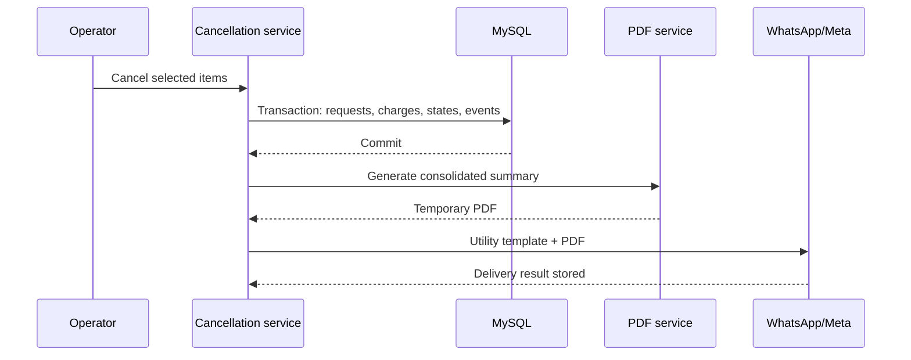

# Design

The cancellation transaction remains the source of truth. PDF generation and WhatsApp delivery execute only after commit, so an integration failure cannot roll back the operational or commercial state.

The idempotency key uses the sorted cancellation-request IDs. This identifies the exact operator operation while allowing another later cancellation for the same order.
