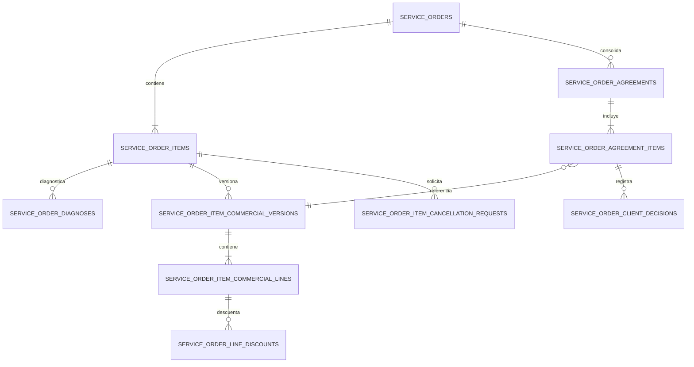
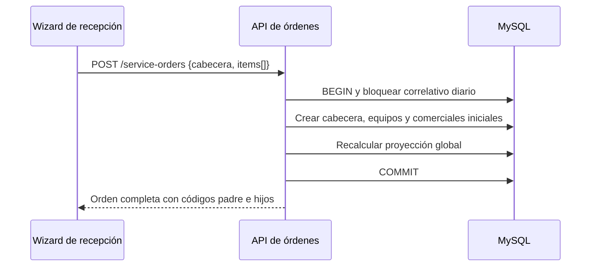

# Design: Órdenes de servicio con múltiples equipos

## Contexto implementado

Hoy `service_orders` mezcla cabecera, equipo, estados, técnico y economía. `POST /service-orders/batch` crea una fila de `service_orders` por candidato. Los diagnósticos y acuerdos apuntan directamente a la orden. El acuerdo tiene líneas de producto y servicio, pero no conserva un snapshot completo de descuentos. El inbox persiste relaciones mensaje-orden e hilo-orden y guarda contadores de no leídos por rol.

Este cambio convierte `ServiceOrder` en raíz agregada y hace que `ServiceOrderItem` represente cada equipo recibido.

## Decisiones de arquitectura

### 1. Cabecera común y equipos hijos

`service_orders` conservará:

- código padre;
- cliente, contacto y snapshots;
- técnico asignado y fecha de asignación;
- tipo de servicio inmutable;
- origen, nota general y fecha de recepción;
- estados agregados y totales económicos proyectados;
- auditoría y timestamps globales.

`service_order_items` contendrá:

- posición y código hijo;
- tipo de equipo, marca, modelo, serie, accesorios y problema inicial;
- prioridad propia, con `LOW` por defecto;
- horas y fecha estimadas;
- estados operativo, técnico y comercial individuales;
- timestamps de revisión, ejecución, resolución, entrega y cancelación;
- `warranty_source_item_id` nullable y autorreferenciado.

El técnico y el tipo de servicio no se duplicarán en los equipos. Reasignar técnico actualiza toda la orden y solo estará permitido a recepción, supervisión y administración.

### 2. Código diario con bloqueo

Se incorporará `service_order_daily_sequences` con fecha de negocio y último valor. La creación bloqueará o incrementará atómicamente la fila de la fecha en `America/Lima`.

- Padre: `SO-02-08-2026-0001`.
- Equipo 1: `SO-02-08-2026-0001-01`.
- Equipo 2: `SO-02-08-2026-0001-02`.

La restricción única del código seguirá siendo la defensa final ante concurrencia.

### 3. Estados agregados como proyección

Los equipos son la fuente de verdad para estados técnicos, comerciales y operativos. La cabecera mantiene una proyección para filtrar y paginar paneles. `ServiceOrderAggregateService.recalculateLocked()` recalculará la cabecera dentro de la misma transacción de cada cambio de equipo.

La proyección distinguirá estados parciales, por ejemplo equipos listos mientras otros siguen en ejecución y equipos entregados mientras otros siguen pendientes. No se inferirá el estado global copiando arbitrariamente el estado de un equipo.

### 4. Diagnóstico y rediagnóstico por equipo

`service_order_diagnoses` apuntará obligatoriamente a `service_order_item_id`. Los flujos que no requieren diagnóstico no crearán diagnósticos vacíos. Un rediagnóstico versionará únicamente el diagnóstico y la definición comercial del equipo afectado.

### 5. Comercial por versión de equipo y consolidado por orden

Se separan dos conceptos:

1. `service_order_item_commercial_versions`: versión cotizada para un equipo.
2. `service_order_agreements`: revisión consolidada que el operador presenta como una sola propuesta de la orden.

Relaciones propuestas:

Las líneas comerciales usarán un modelo único con tipo `PRODUCT`, `SERVICE` o `ADJUSTMENT`, referencias opcionales a catálogos y snapshots inmutables de código, nombre, descripción, cantidad y precios.

Los descuentos se registrarán por línea en `service_order_line_discounts` con regla/configuración de origen nullable, nombre, tipo, valor, importe y usuario aplicador. El total neto aceptado se copiará a venta; no se recalculará usando una configuración posterior.

Cuando solo cambia un equipo, se crea una nueva versión comercial de ese equipo. La siguiente revisión consolidada puede volver a referenciar versiones ya aceptadas de equipos sin cambios. Por ello, una aceptación previa válida no se pierde.

### 6. Decisiones del cliente

Las respuestas serán append-only en `service_order_client_decisions`:

- decisión: `ACCEPTED`, `CHANGE_REQUESTED`, `REJECTED` o `CANCELLATION_REQUESTED`;
- versión exacta afectada;
- usuario que la registró;
- canal: WhatsApp, llamada, presencial u otro;
- fecha y observación.

Recepción, técnico asignado, supervisor y administración podrán registrar decisiones y aplicar descuentos dentro de los límites configurados. Un descuento fuera del máximo requiere una autorización específica de supervisor; no se concederá implícitamente por poder editar la cotización.

El acuerdo global queda `CONFIRMED` solo cuando todos los equipos no cancelados están aceptados. Hasta entonces ningún equipo puede pasar a ejecución.

### 7. Cancelación manual por equipo

Toda cancelación crea `service_order_item_cancellation_requests` para mantener trazabilidad.

- Recepción, técnico asignado o supervisor pueden seleccionar uno o varios equipos cancelables en una sola operación, con un canal y motivo comunes.
- En `ASIGNADA`, la cancelación es inmediata y sin cobro.
- Desde `EN_DIAGNOSTICO`, la cancelación también es inmediata, pero genera un cargo fijo confirmado de S/ 20 por cada equipo afectado.
- Cuando exista al menos un cargo, el operador debe confirmar expresamente que informó al cliente antes de ejecutar la operación.
- Los cargos de una selección múltiple se consolidan en un solo acuerdo confirmado y quedan pendientes de pago, con una línea y versión comercial separada por equipo.
- La operación completa es atómica: cualquier equipo no cancelable, falta de constancia o error comercial revierte todas las cancelaciones seleccionadas.
- Si existe una venta confirmada cuya cobertura se reduciría, la cancelación no puede finalizar silenciosamente. Primero debe revertirse el comprobante mediante el flujo transaccional existente y luego emitirse el reemplazo. Una venta agrupada se revierte como unidad; no se simulará una anulación parcial inexistente.

### 8. Economía global y entrega parcial

El importe comprometido y reconciliado pertenece a la orden. La facturación puede conservar agrupación de muchas órdenes del mismo cliente, pero cada línea creada desde acuerdos deberá guardar los códigos de orden y equipo que representa.

La entrega física se solicita por equipo y no reemplaza el resultado del servicio. Un equipo cancelado conserva `CANCELADA` después de ser devuelto y `deliveredAt` registra la entrega. Para entregar un equipo activo se exige:

- que el equipo esté listo;
- que no tenga cancelación pendiente;
- que el acuerdo global vigente esté confirmado;
- que la orden tenga cobertura económica total o exoneración.

Una cancelación sin cargo puede entregarse inmediatamente. Una cancelación con cargo de diagnóstico exige cobertura económica total o exoneración. Una vez habilitados, los equipos pueden entregarse en momentos distintos y el progreso físico considera también los cancelados pendientes de devolución.

### 9. Garantía por número de serie

Los números de serie de equipos seguirán siendo opcionales y no únicos. Se almacenará además una forma normalizada e indexada para búsqueda exacta.

En una orden de garantía, el API buscará equipos históricos por serie normalizada y devolverá candidatos ordenados por la entrega más reciente. Una coincidencia puede completar cliente, contacto y datos del equipo, pero el operador confirma el candidato. Si no existe origen, se permite captura manual. La referencia no decide si la garantía procede: el técnico lo define mediante el diagnóstico.

La UI mostrará fechas y cobertura conocida como información. Estar fuera de plazo no bloqueará técnicamente el registro.

### 10. Inbox centrado en cliente

Se eliminarán `service_order_inbox_thread_order_links` y `service_order_inbox_message_order_links`. Un hilo representa la comunicación empresa-cliente y ningún mensaje acepta IDs de orden.

El contexto lateral consulta las órdenes recientes por `client_id` de la conversación. El título será “Órdenes recientes del cliente”, no “Órdenes vinculadas”. Si el hilo aún no tiene cliente resuelto, el backend puede intentar resolverlo por teléfono, pero no persiste una asociación con órdenes.

Los contadores por rol se reemplazarán por `service_order_inbox_thread_reads(thread_id, user_id, last_read_message_id, read_at)`. El no leído se calcula por usuario. Todo usuario con `service-order-inbox.read` puede ver todos los hilos, sin depender de técnico asignado ni de órdenes.

### 11. Autorización por acción

Se agregarán acciones específicas, como mínimo:

- `service-order.item-transition`;
- `service-order.item-deliver`;
- `service-order.item-cancel`;
- `service-order.item-cancel-after-start`;
- `service-order-agreement.record-client-decision`;
- `service-order-agreement.apply-discount`;
- `service-order-agreement.override-discount-limit`.

El backend validará además que un usuario cuyo único rol operativo sea técnico actúe sobre una orden asignada a él. Recepción y supervisión conservan alcance transversal según sus permisos.

### 12. Contrato de creación atómico

`POST /service-orders` aceptará una cabecera y `items[]`. Los acuerdos iniciales que correspondan a servicios directos se incluirán en el mismo comando o se crearán por una operación interna dentro de la misma transacción. No se enviará un segundo conjunto de solicitudes desde Angular que pueda dejar una orden parcialmente creada.

`POST /service-orders/batch` quedará retirado después de migrar el frontend. Un solo item utiliza el mismo contrato con un arreglo de longitud uno.

### 13. PDF único

El PDF de recepción se genera desde la cabecera y lista todos los equipos, accesorios, fallas, prioridades y códigos hijos. No se generará un PDF por equipo durante la recepción.

### Prioridad exclusivamente por equipo

`service_order_items.priority` es la única fuente de verdad. La cabecera no conserva una copia, prioridad agregada ni prioridad derivada. Los listados de órdenes no filtran ni muestran prioridad; el dato se consulta dentro del detalle de cada equipo. Los SLA dependientes de prioridad se calculan por equipo.

### Consulta de equipos en recepción

El listado de recepción omite las columnas de prioridad y equipo. Una acción primaria `Ver equipos` abre un modal accesible con todos los ítems de la orden, sus datos técnicos, prioridad y estados. Las acciones globales permanecen en la fila de la orden y las acciones individuales parten del equipo seleccionado.

## Estrategia de migración

La migración de staging será deliberadamente destructiva para el dominio de órdenes de prueba.

1. Requerir backup verificado y `ALLOW_SERVICE_ORDER_DATA_RESET=true`.
2. Abortar si la bandera no está presente.
3. Eliminar vínculos de orden con ventas e inbox sin eliminar ventas ni conversaciones.
4. Eliminar eventos, notificaciones, documentos temporales, acuerdos, diagnósticos y órdenes existentes.
5. Reestructurar tablas y crear las nuevas restricciones e índices.
6. Preservar clientes, contactos, usuarios, permisos, catálogos, inventario, ventas y mensajes.
7. Ejecutar pruebas de esquema con MySQL real antes de staging.

MySQL hace commits implícitos para diversas operaciones DDL. El backup, no el `down`, es la recuperación confiable de los datos eliminados.

## Riesgos y mitigaciones

- **Cambio transversal grande:** entregar por cortes verticales con pruebas RED antes de cada implementación.
- **Paneles Angular extensos:** extraer componentes/fachadas por equipo y comercial en vez de añadir más lógica a los archivos grandes.
- **Estados globales divergentes:** una sola función de proyección, llamada dentro de las transacciones.
- **Facturación ya emitida:** bloquear reducción de cobertura hasta revertir y reemitir; no editar ventas confirmadas.
- **Colisión de correlativos:** secuencia diaria bloqueada y restricción única.
- **Datos destructivos:** bandera explícita, preflight y backup obligatorio.
- **Varias réplicas SSE:** el transporte actual sigue siendo válido para una instancia; una futura escala requerirá broker compartido sin cambiar el contrato del frontend.

## Orden de implementación

1. Esquema, entidades y contrato de creación.
2. Wizard y PDF de recepción.
3. Estados y diagnósticos por equipo.
4. Versionado comercial, descuentos y decisiones.
5. Cancelación y entrega parcial.
6. Facturación y proyección económica.
7. Garantía por serie.
8. Paneles operativos.
9. Inbox sin vínculos y lecturas por usuario.
10. Migración MySQL, E2E y despliegue en staging.
