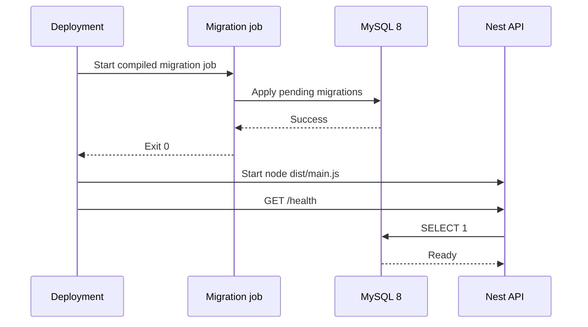

# Design

## Decisions

- Nest and the TypeORM CLI SHALL consume one connection-options factory.
- `synchronize` and `migrationsRun` SHALL remain disabled in every normal runtime environment.
- Production migrations SHALL run as compiled JavaScript in a separate deployment job.
- Readiness SHALL execute `SELECT 1`; liveness SHALL not access MySQL.
- Existing public routes SHALL remain unchanged and no global prefix SHALL be introduced.

## Deployment sequence

