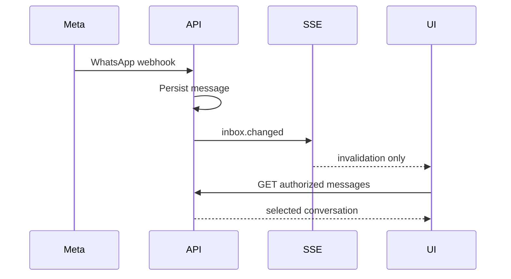

# Design

The API uses an in-process RxJS publisher and a Nest SSE endpoint. Events are intentionally content-free invalidations. On receipt, the frontend reloads the already-authorized thread list and, when applicable, the selected conversation.

This implementation covers a single API process. A future multi-replica deployment must replace the publisher transport with a shared broker while retaining the same event contract.

